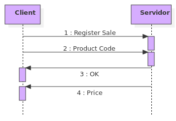
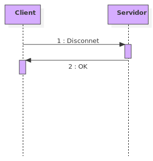
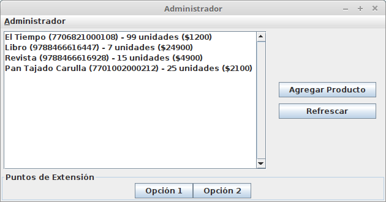
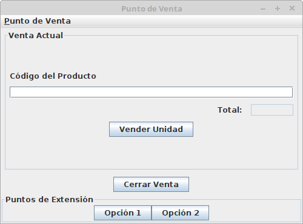
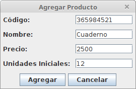

### Enunciate

The objective of this exercise is to model a simple inventory and sales system for a warehouse.
The exercise is composed of two applications that communicate with each other using sockets and
the persistence will be performed on a relational database.

There are two main applications: the warehouse server with its administration system and the
customer who is the point of sale.

The warehouse server is an application that is in charge of (1) adding new products, (2) consulting
the products that are in the warehouse and (3) attending the registration requests of sale of
products from the point of sale.

The customer at the point of sale can (1) register the sale of a product using his code using the
service offered by the warehouse server and (2) must also keep track of the total value of the
sale being registered.

Within the system each product has 4 attributes: code, name, price and number of units available.

The protocol will be handled specifically in two parts.

1. Register Sale

2. Disconnect

 Persistence

A system called Derby, which is developed in the Apache Derby project and which arose from IBM's
Cloudscape, will be used as the database engine.

This database has several features that make it quite interesting and suitable for this exercise:
First Derby is a database system developed entirely in Java and has a file-based persistence system.

On the other hand Derby can be used as a separate engine or as an embedded database.
The first means that one could create a Derby server completely apart from the application and
communicate with it through sockets and possibly from different machines.
The second (embedded database) means that you can use the database as if it were a part of the
application although in this case you could not perform operations from other applications.
In Derby, although the two access modes are in the background quite different, it is very easy
to switch from one to the other and does not imply very strong changes to the application.

For the application the embedded database will be used. Within the database there will be only
one table (Product) with four attributes: code and name, which will be strings of characters, and
price and units, which must be integers. Also in this table the code will be the primary key, which
means that there can not be two products with the same code.
 
### Interface

